Added screenshot in READMR.md

## 🖼️ Screenshots

### Screenschot_hw_12

### HW12
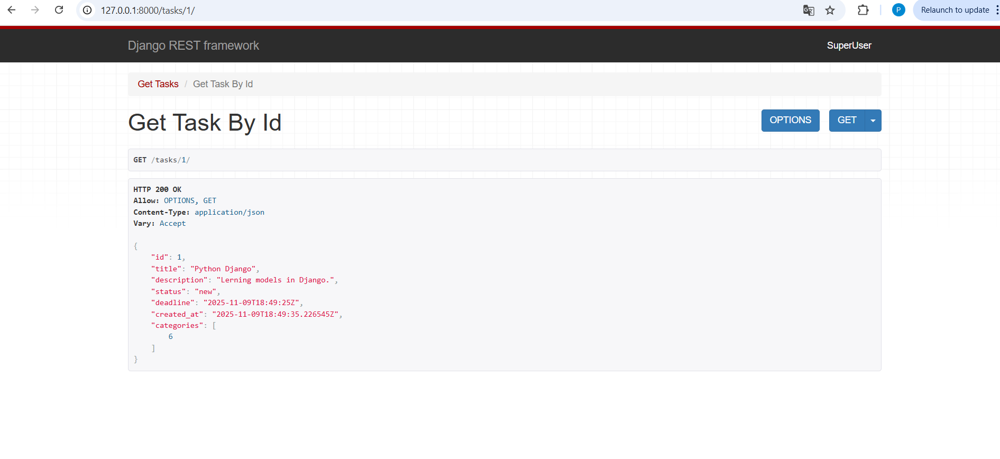

### hw
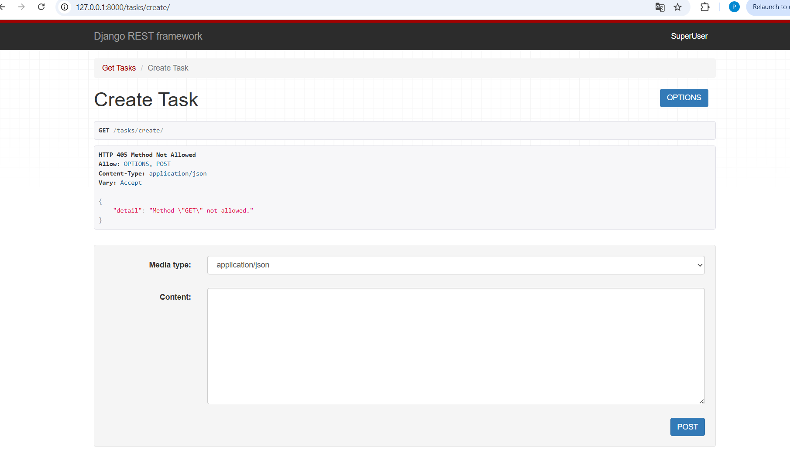

### HW_12
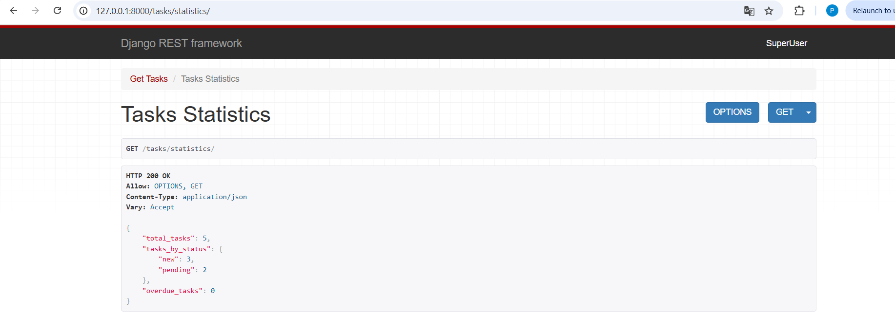

### Postman 1
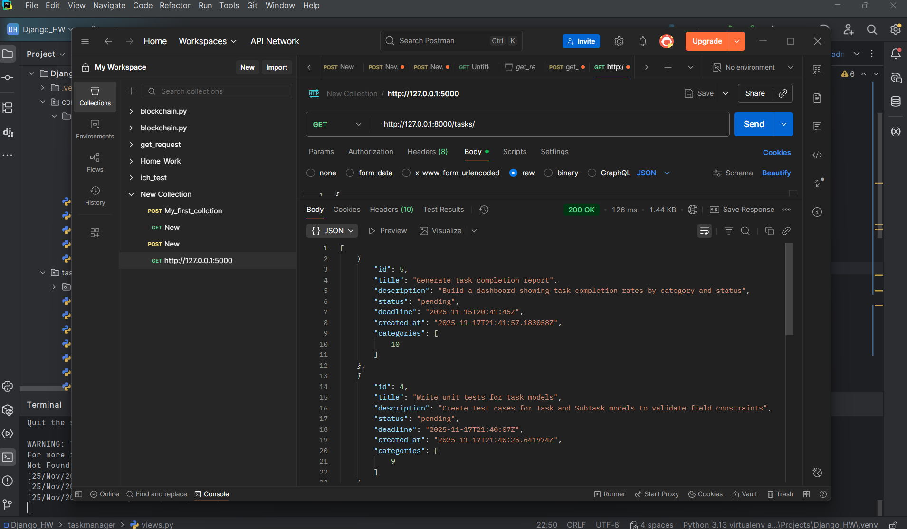

### Postman 2
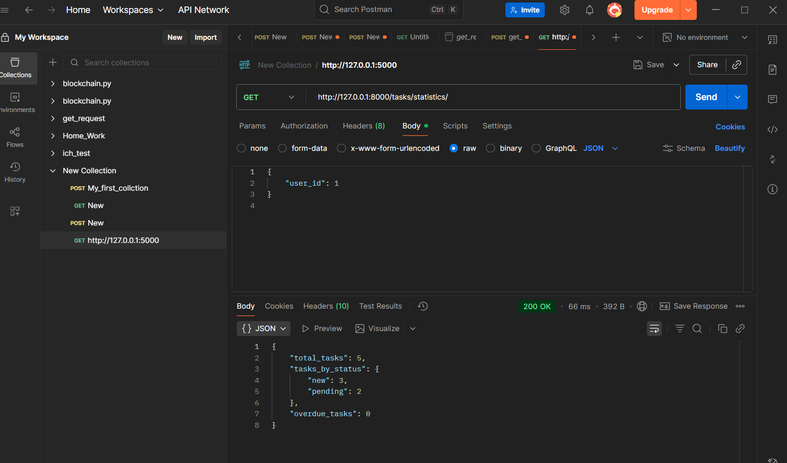

### Postman 3
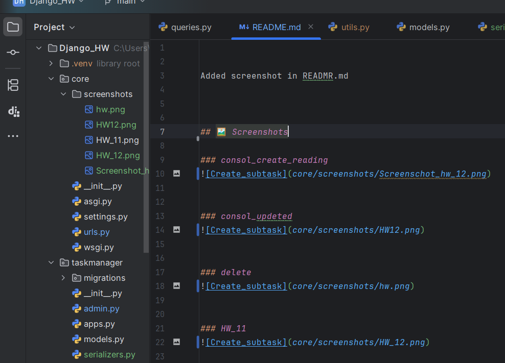

### Postman 4
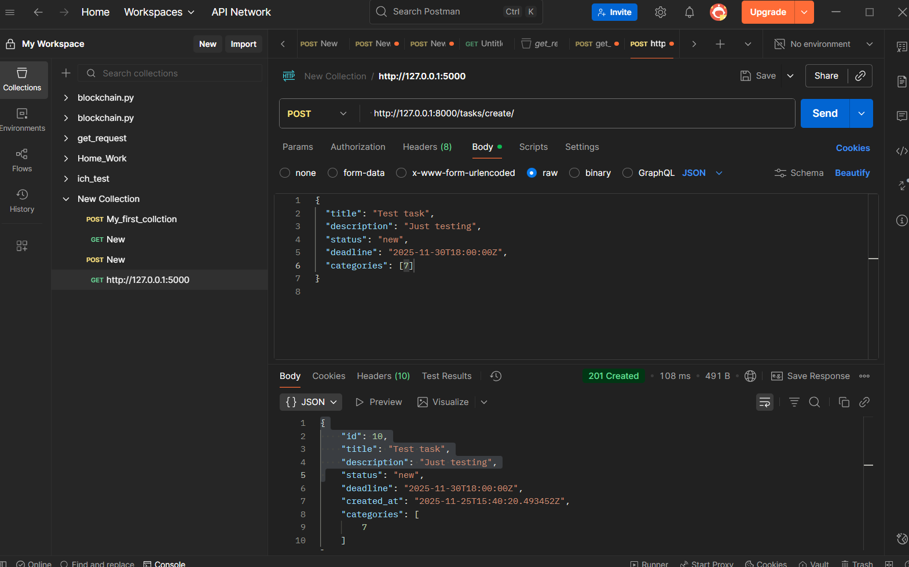

### Home_Work 13
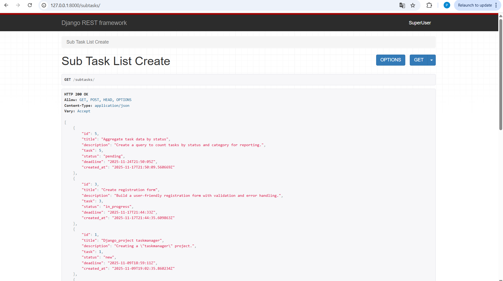

### HW_13
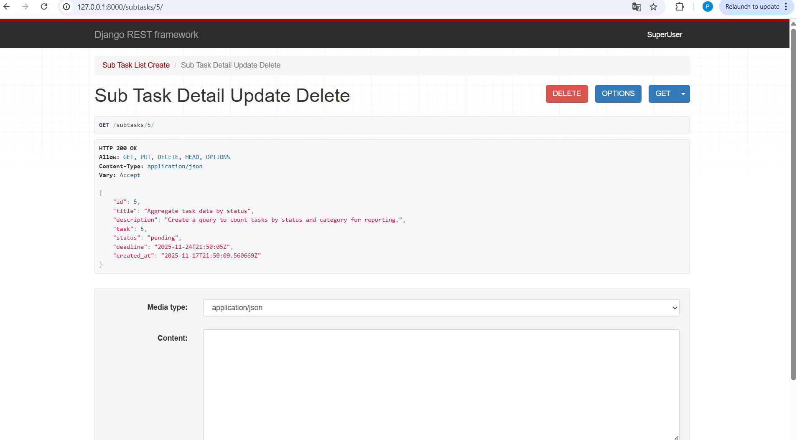

### HW_14
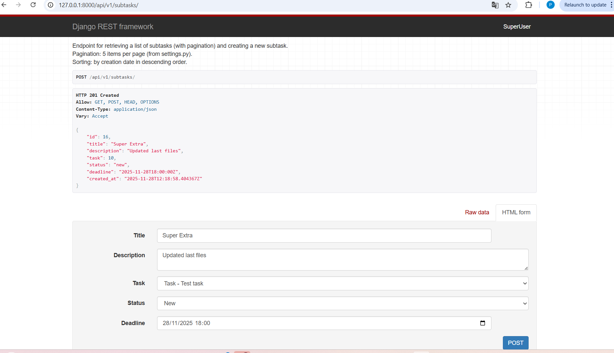

### hw14
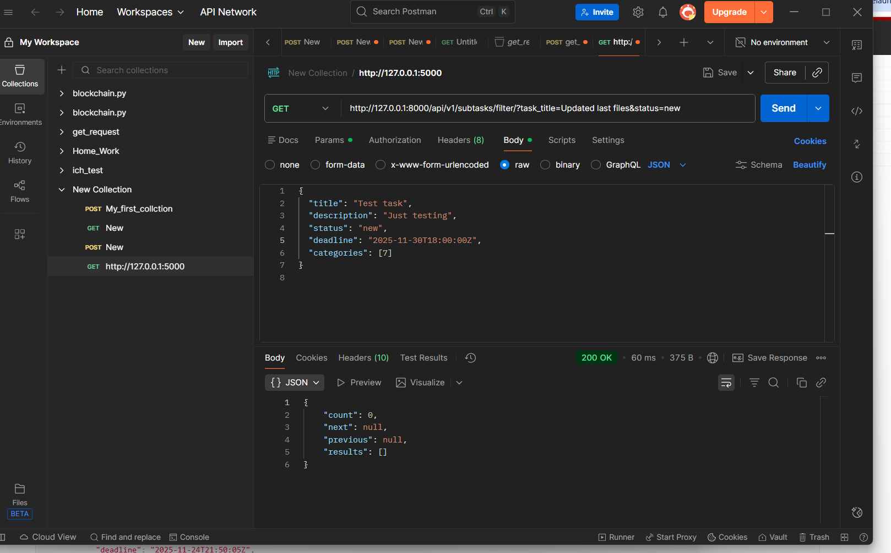

### hw14postman
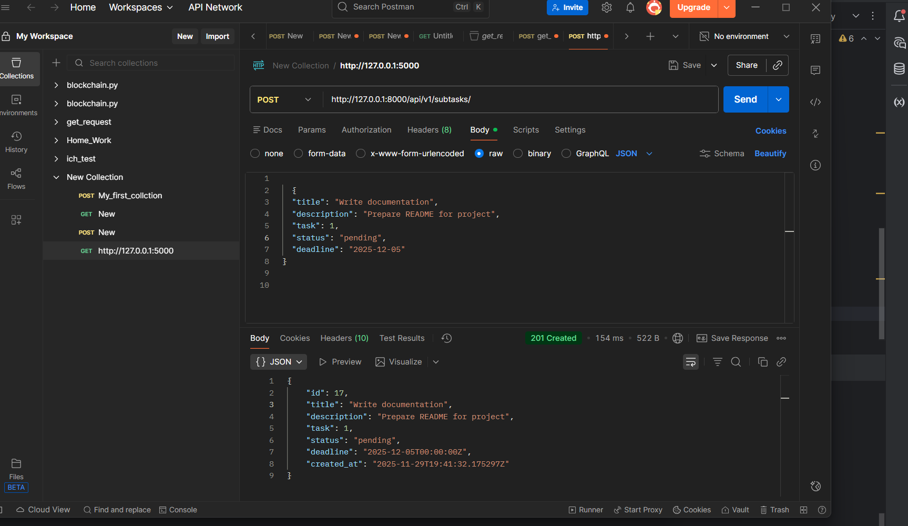

### HW_14_postman
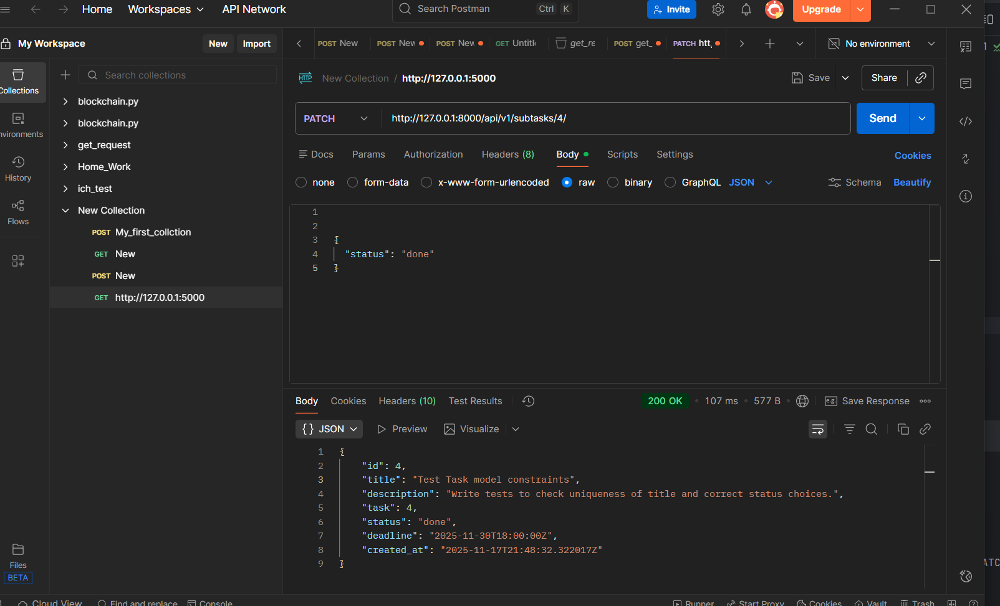

### postman_hw_15
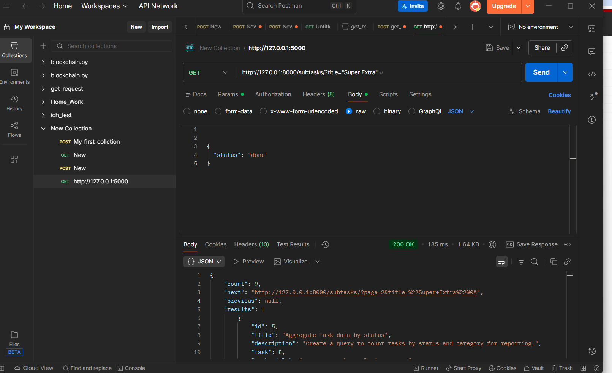

### postmanHW_15

### HW_15_postman
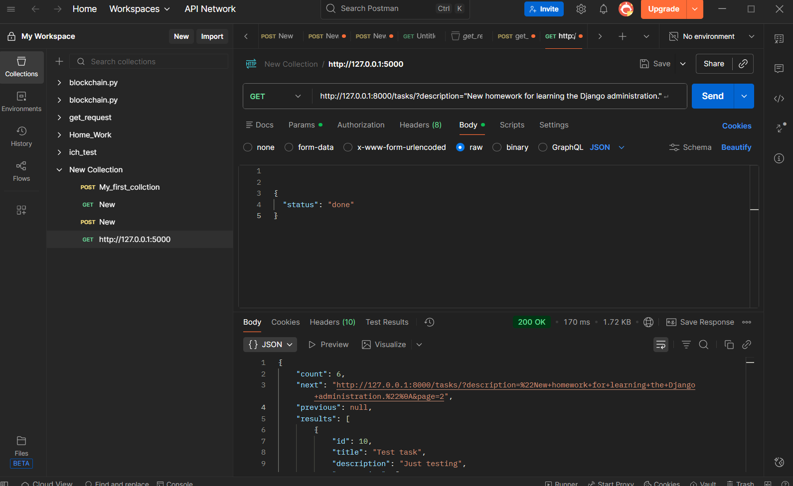

