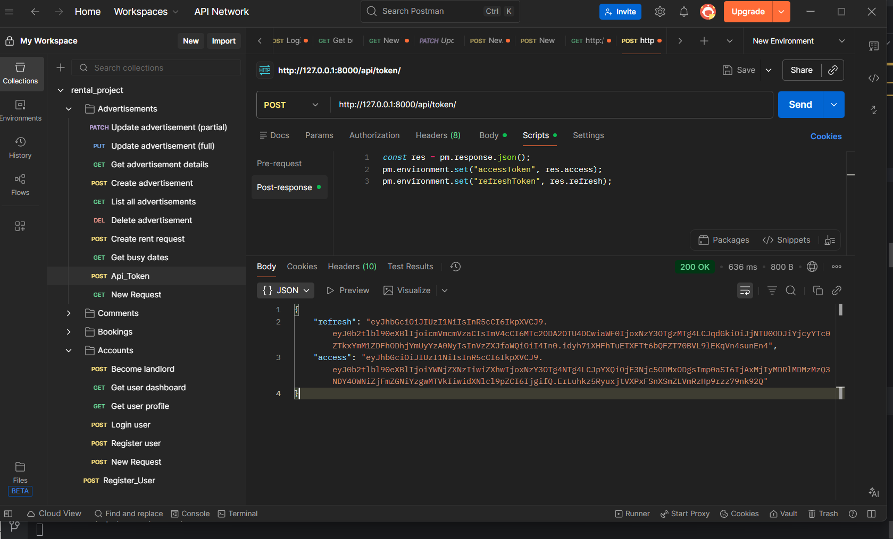
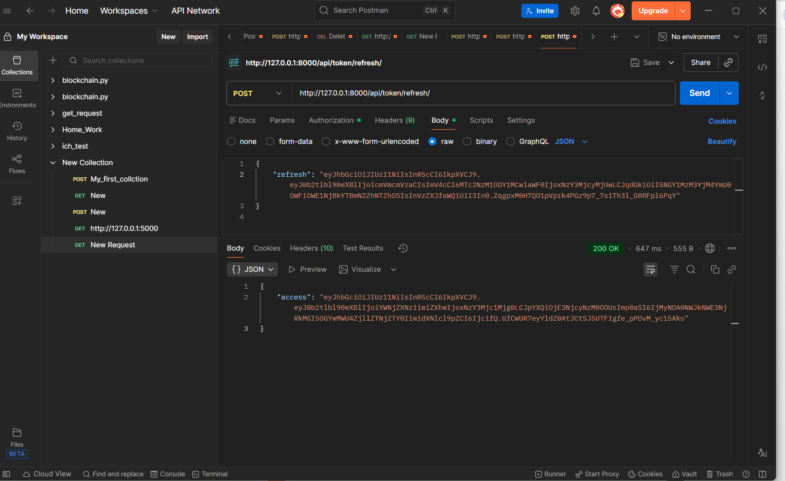
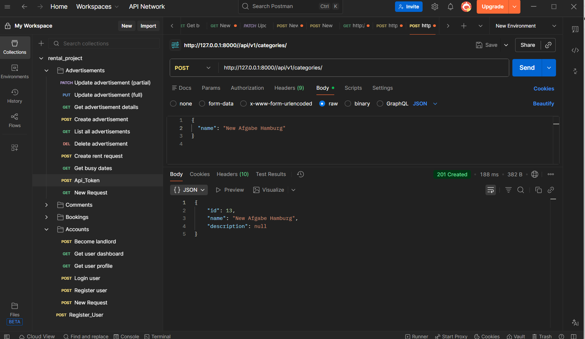
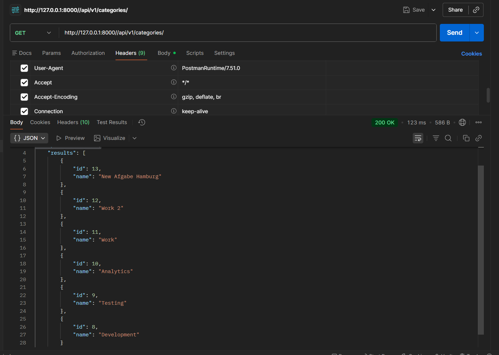
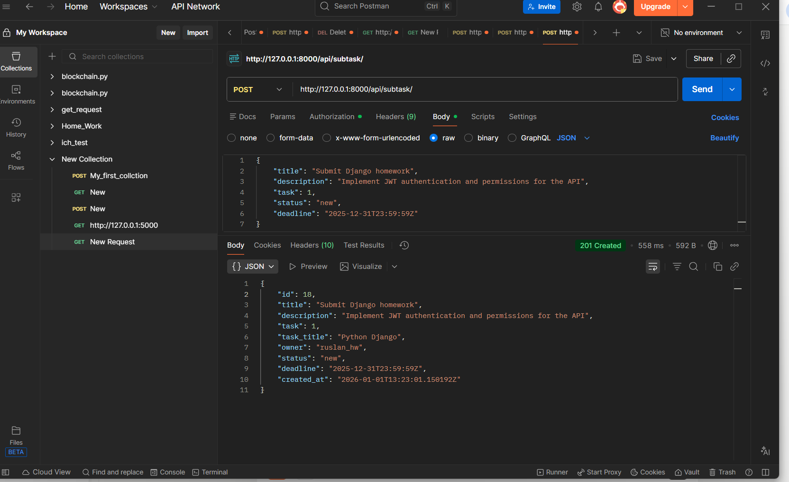
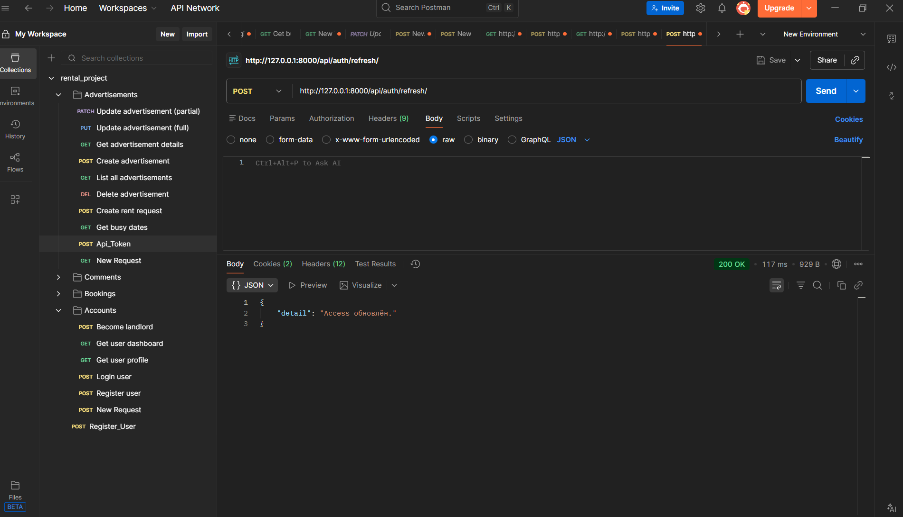
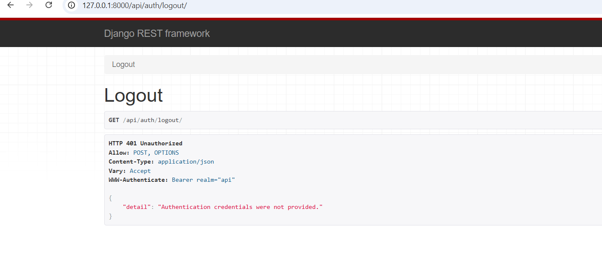

# Homework  — JWT, Permissions, Pagination

## Get API token

## Refresh token

## Create category

## Pagination example

## Create subtask

# Homework 20 — Registration, Login, Logout (JWT)

## User registration

## Login (JWT in httpOnly cookies)

## Refresh access token

## Logout

