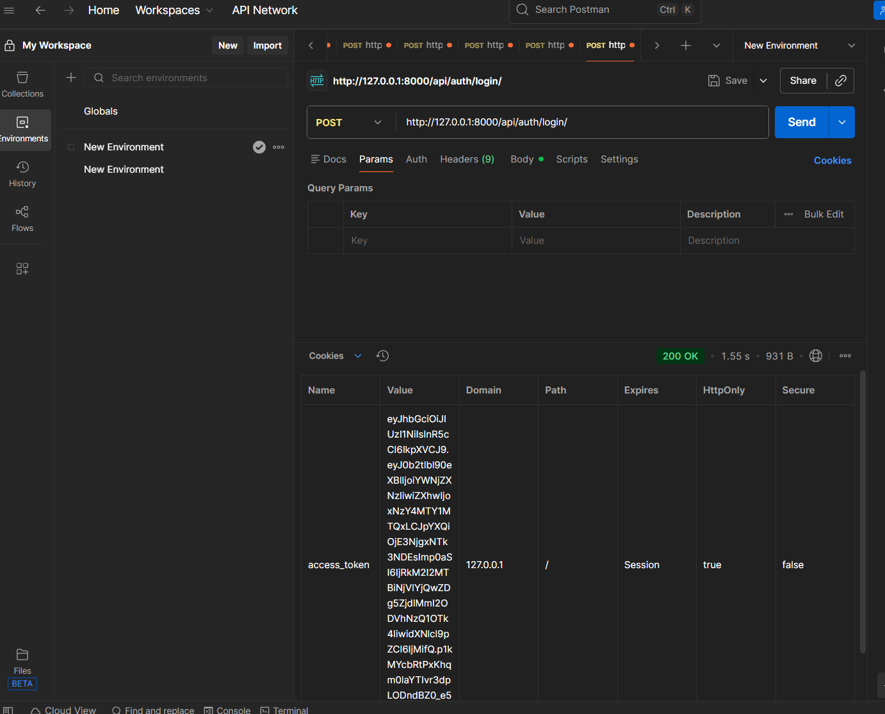
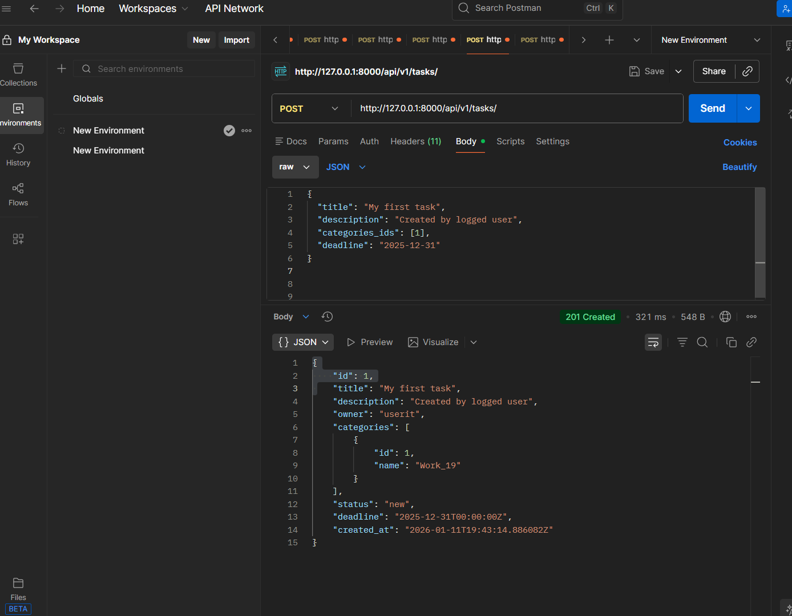
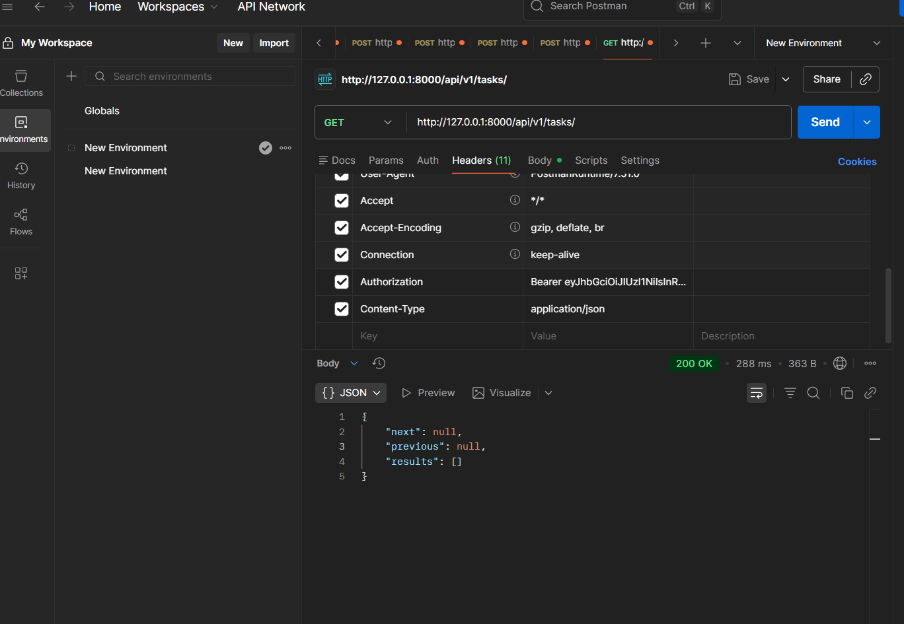
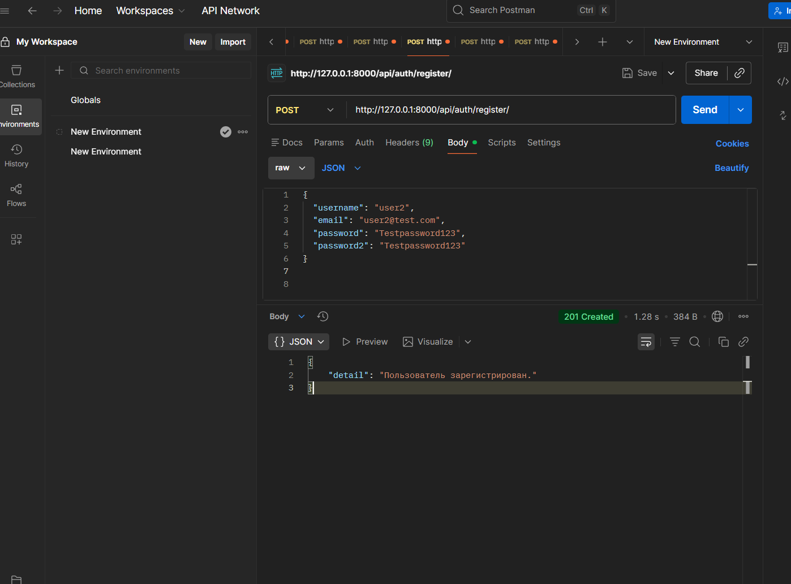
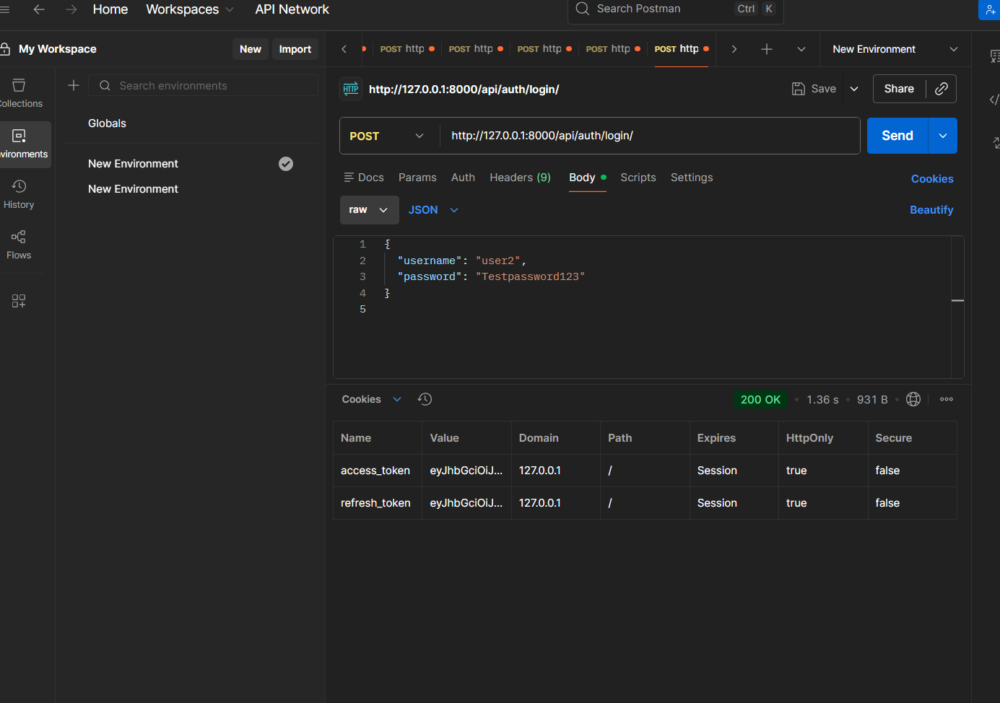
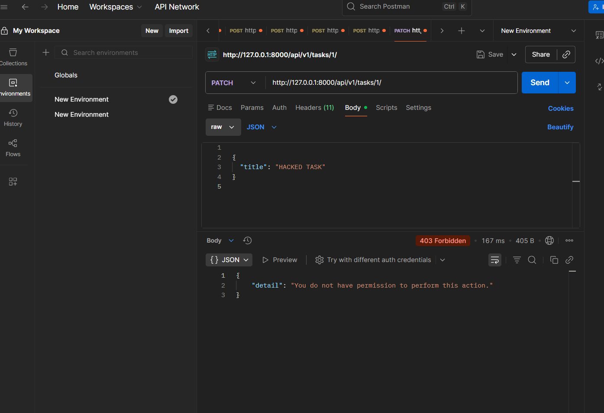
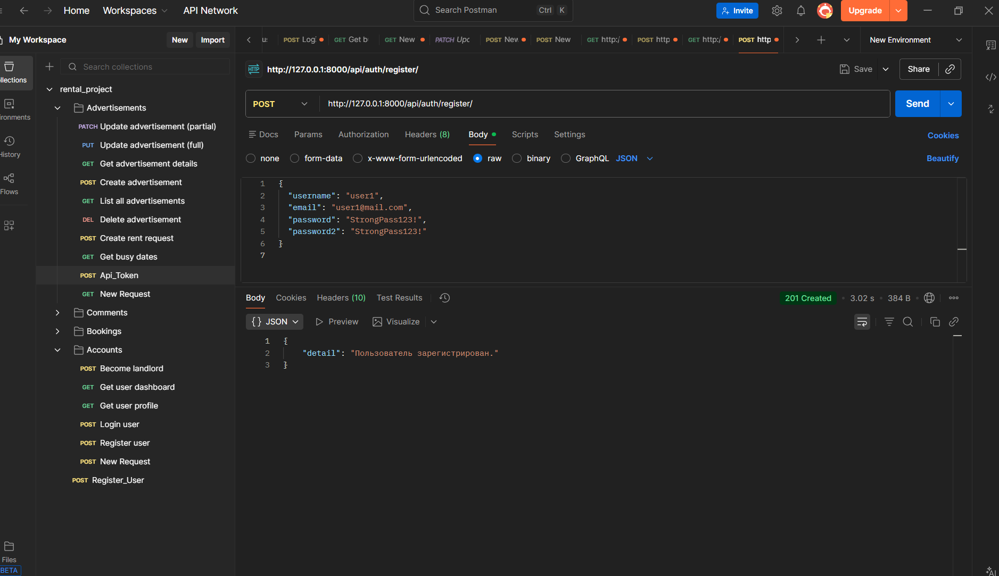

# Homework 18–19–20 — JWT, Permissions, Pagination, Swagger, Auth

---

## Homework 18 — JWT, Permissions, Pagination

### Get API token

### Refresh token

### Create category

### Pagination example

### Create subtask

---

## Homework 19 — Owner, Object permissions, My tasks, Swagger

### User registration (user1)

### User login (user1)

### Create task (owner auto)

### Get tasks (pagination / results)

### User2 registration (for permissions test)

### User2 login (for permissions test)

### User2 попытка изменить/удалить чужую задачу (permissions)

---

## Homework 20 — Registration, Login, Logout (JWT in httpOnly cookies)

### User registration

### Login (JWT in httpOnly cookies)

### Refresh access token

### Logout

